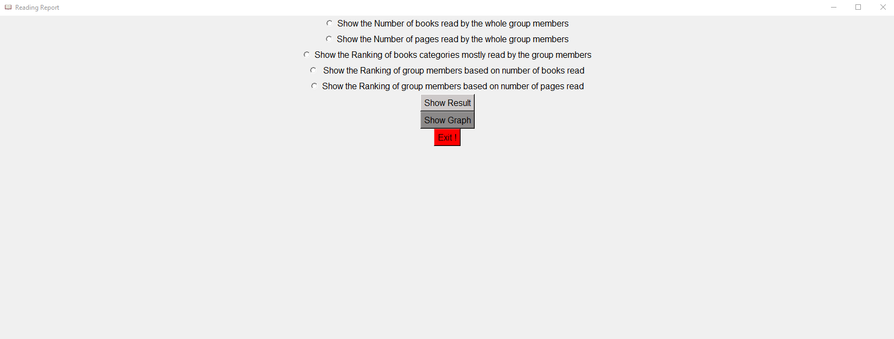
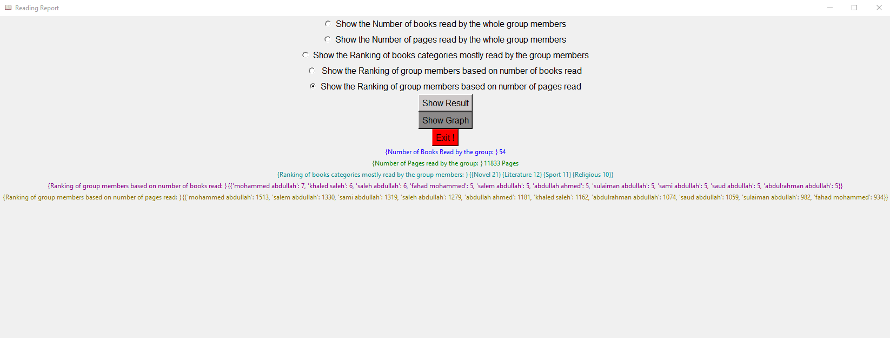

# Monthly Report for Group Reading
This is a program to produce a monthly report for the group reading. The report includes some statistics about what the group has read during the month.

## Requirements
* Python (3.7)
* NumPy (1.19.0)
* Matplotlib (3.3.3)

## Graphical User Interface (GUI)
The program has a Graphical User Interface (GUI) which make the program be easier and if you want to use the compiler for inputs and outputs, you can click on the red [X] and use the compiler.

## input file
* The input file format must be .txt and the Name of the file must be: inputFile (inputFile.txt)

## How to use:
* Show Result: To Show the statistics about what the group has read during the month 
* Show Graph: To show graphs about the ranking statistics.
* Exit: To Close the program.
